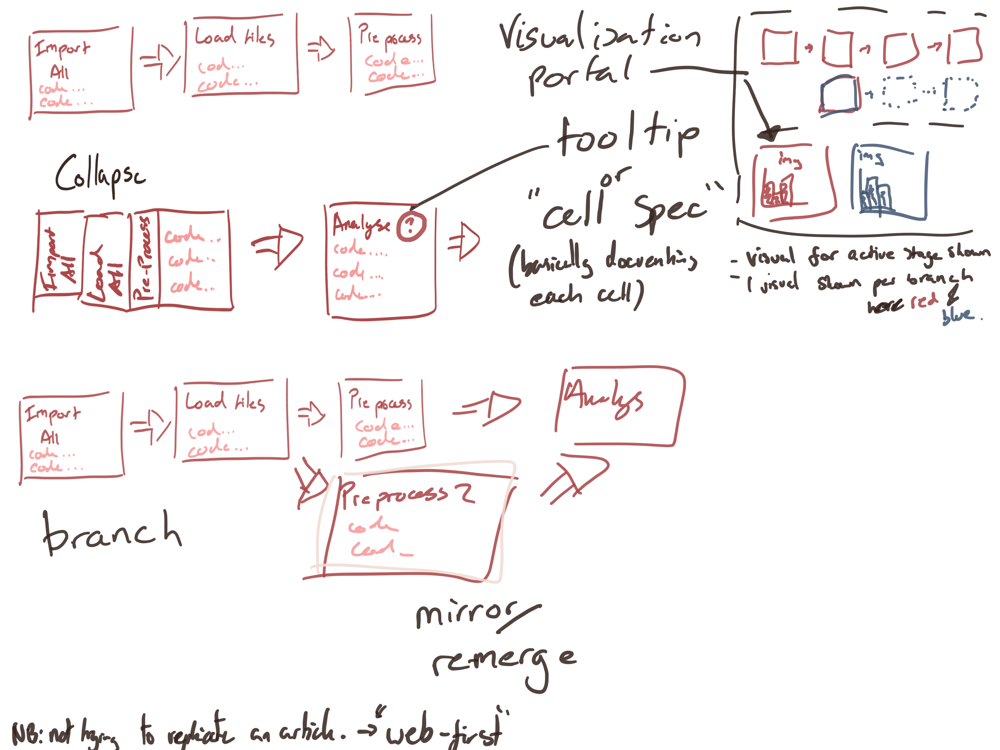

# Graphical Notebooks
**Computational notebooks that reflect the mental model of humans**  

A core tenet of user-centered design is that user interfaces should, as much as possible, reflect the prior mental model that the user has of a process. Just as syscall API hides hardware-specific details from programmers developing applications, abstractions at each level of a user interface offer an opportunity to reduce the mental load on the user, enabling them to perform more complex tasks and make fewer mistakes. However these abstractions, however well implemented, will often have tradeoffs in terms of the complexity or performance of the application.

Computational notebooks, such as Jupyter and Wolfram, have had broad success by reflecting in their interface an existing user model i.e. “this code produces this visualisation” by allowing multimedia to be embedded as part of a script. Jupyter has arguably had more success not only because it is free software, but also by piggybacking on existing programming languages which allows users to transfer previously applied models into a new context, rather than having to learn something new. Both types of computational notebooks also reflect the modularity inherent in analysis pipelines, reading in some files might take more than one line of code but most of the time we just want to think about the process as “reading in the files”. In programming language design this is solved using functions, modules and namespaces, in computational notebooks it is reflected in the UI in the form of code cells.

Through personal experience, and observations of wider usage patterns of Jupyter notebooks we have gleaned that there is still room for moving even closer to the user's mental model of how code should be organised for data analysis. We propose design a new user interface that capitalizes on what Jupyter already does well, and fills in the gaps where they exist. In our first prototype we aim to support:
- Branching Paths: reflecting the generally non-linear flow of exploratory analysis and testing
- Hierarchical Modularity: Allow collapsing and grouping of cells for organisation. Indeed, whole notebooks can be included as one unit of computation in another notebook using this framework.
- Modularity II: Allow naming and documenting to be explicitly linked to code cells. Allow decoration of code cells for easy recognition while they are collapsed.
- Horizontal (left to right * ) progression model: Take advantage of modern widescreen hardware, and the natural reading pattern to specify workflows that flow across the screen, with branches being represented by vertical splits. * or right to left depending on locale

Many of the concepts here are well validated in current / past software, the next section discusses some of this prior art as well as the goals underlying other work on the Jupyter UI.

## Prior Art
### Visual Programming
[Wiki page](https://en.wikipedia.org/wiki/Visual_programming_language)

#### Examples:
[Max](https://en.wikipedia.org/wiki/Max_(software))

[KNIME](https://en.wikipedia.org/wiki/KNIME)

[LabView](https://en.wikipedia.org/wiki/LabVIEW)

[WebML](https://en.wikipedia.org/wiki/WebML)

[Orange](https://en.wikipedia.org/wiki/Orange_(software))

[Alteryx](https://pages.alteryx.com/Alteryx-Overview-Demo-ty.html?aliId=230367714)

[Open Source Alteryx Alternatives](https://www.reddit.com/r/Alteryx/comments/5tvp5i/opensource_alteryx_alternative/)

### Other directions for improving notebook interfaces
[JupyterLab](https://www.google.com/search?client=ubuntu&channel=fs&q=jupyterlab&ie=utf-8&oe=utf-8) - Desktop environment in the browser

[Collab](https://colab.research.google.com/) - Easy connection to cheap/free cloud compute resources inluding GPU support.

[Wrattler](https://www.usenix.org/system/files/conference/tapp2018/tapp2018-paper-petricek.pdf) - Data Dependency graph allowing polyglot notebooks and cacheable cells.

## Proposed Interface
TODO: update this with figma designs

Branching Paths:

reflecting the generally non-linear flow of exploratory analysis and testing

### Feature Spec

Hierarchical Modularity:

Allow collapsing and grouping of cells for organisation. Indeed, whole notebooks can be included as one unit of computation in another notebook using this framework.

Modularity II:

Allow naming and documenting to be explicitly linked to code cells. Allow decoration of code cells for easy recognition while they are collapsed.

Horizontal (left to right * ) progression model:

Take advantage of modern widescreen hardware, and the natural reading pattern to specify workflows that flow across the screen, with branches being represented by vertical splits. * or right to left depending on locale

Explicit linking of figure to code diff

In a given session, it should always be possible to view the answer to the question: what were the code changes between Figure (state) A and Figure (state) B? Importantly Figures (states) A and B can be any Figure (or explicitly saved state) generated during the session.

## Process and Design Principles
### Accessibility
- Ease of sharing
- First-Class support for Offline / Limited Connectivity scenarios

### User Centered
- Always aiming to reflect mental model that people already have.
- Finding current pain points in notebook use.
- Get user feedback early (from now) and often.

## Engeneering Considerations
### Back-ends
- In the browser (pyodide et al. - other languages that compile to js/wasm)
- Jupyter backend/kernel 
- Just one (would have to be jupyter) or consider both from the start and allow switching - this will affect some of the deicisions below.

### How to fork / branch?
Simplest implementation is to run from start until the branch point then update cells on the new branch after the branch point only when selected.
- Communication between branches: No they should be independent
- Threads vs. Seperate instances: Seperate instances for backend to start. In browser should be sandboxed as well.
- Copy memory vs Run from start: Run from start for now. Copy could be implemented later on as an optimization.
- *Where* is the logic implemented: Front-end? Will work for iodide and jupyter. Back-end? Easier and maybe more powerful, + will need *some* backend logic for jupyter either way.

### Misc
- Native or web-only: Web only to start with. Fast response times to all user interactions still a priority though. Use native HTML elements where possible.

## Management / Process and Relationships with other Organisations and Stakefolders
Key stakeholders:
- Mozilla & Helmsley Charitable Trust (Alex's funders)
- Jupyter (current developers of notebooks)

- When to engage with each stakeholder?
- How to keep everyone updated on progress?
- How to get support without burdening stakeholders as well as give support where possible?

## Misc Notes
[Graph Rewriting](https://en.wikipedia.org/wiki/Graph_rewriting)

[On Weaponised Design](https://ourdataourselves.tacticaltech.org/posts/30-on-weaponised-design/)
